# Smart Parking App
Smart Parking is an application for android users where user can book there vichels parking in nearby user's location.

# Technology used

# Screenshot

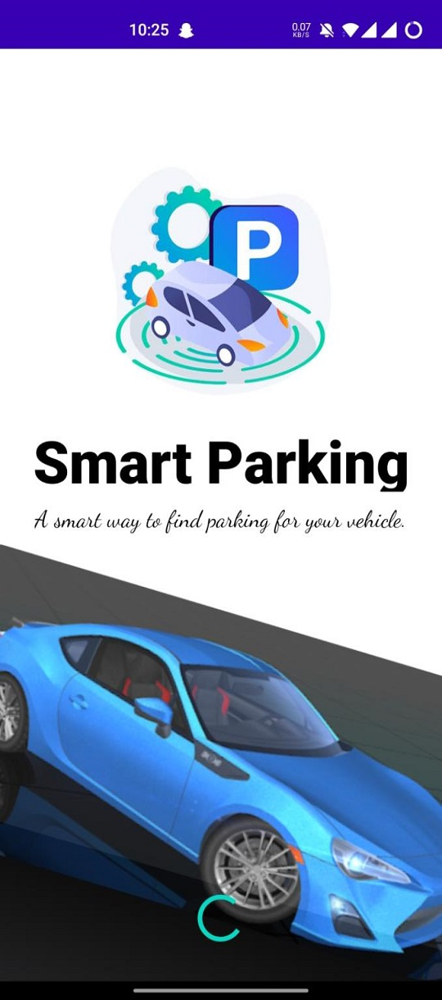
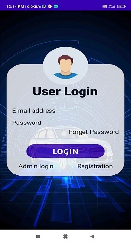
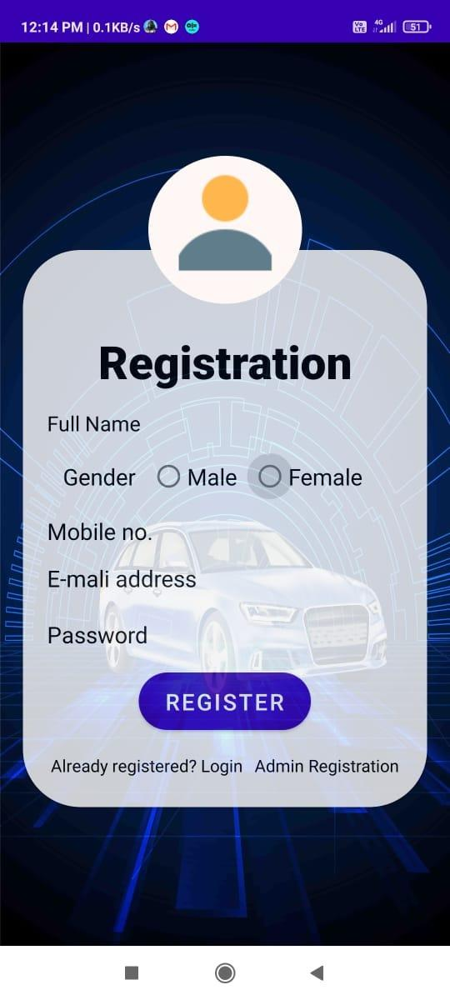

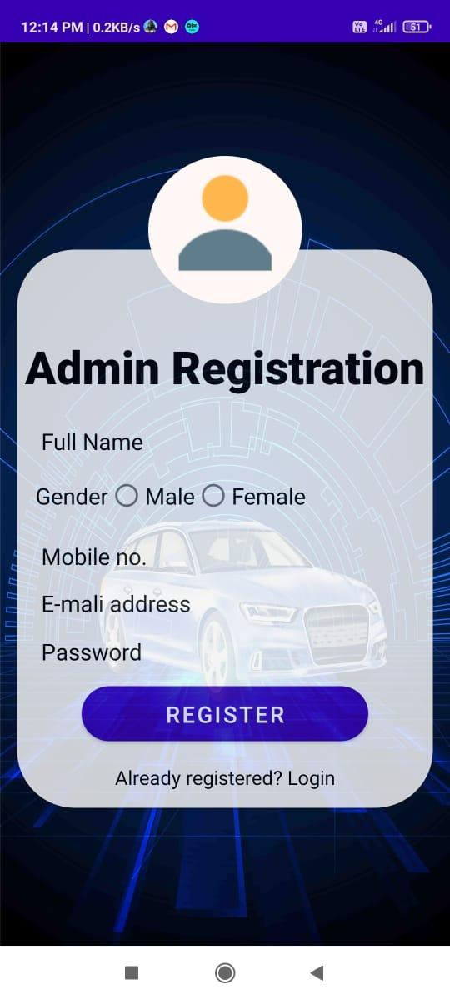
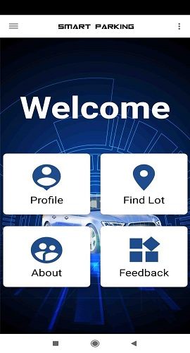

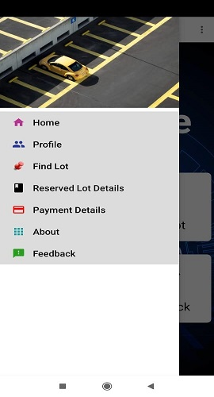
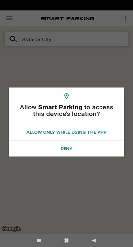
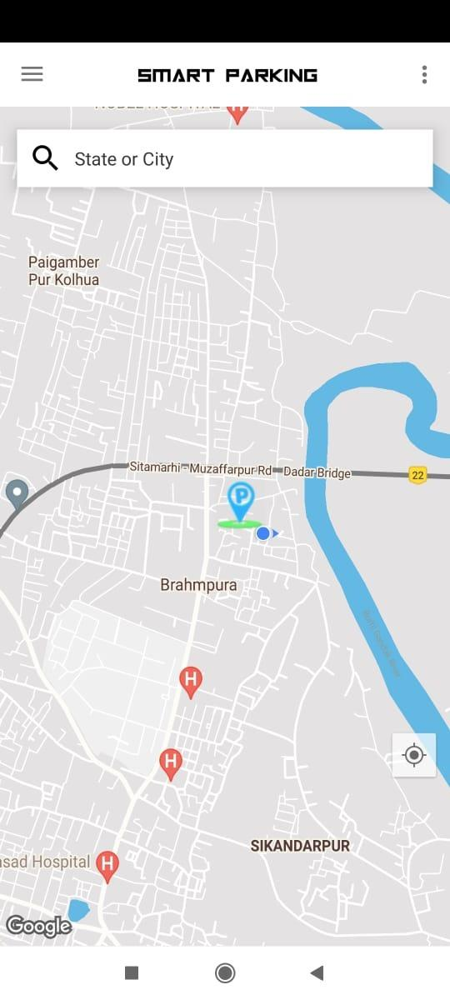
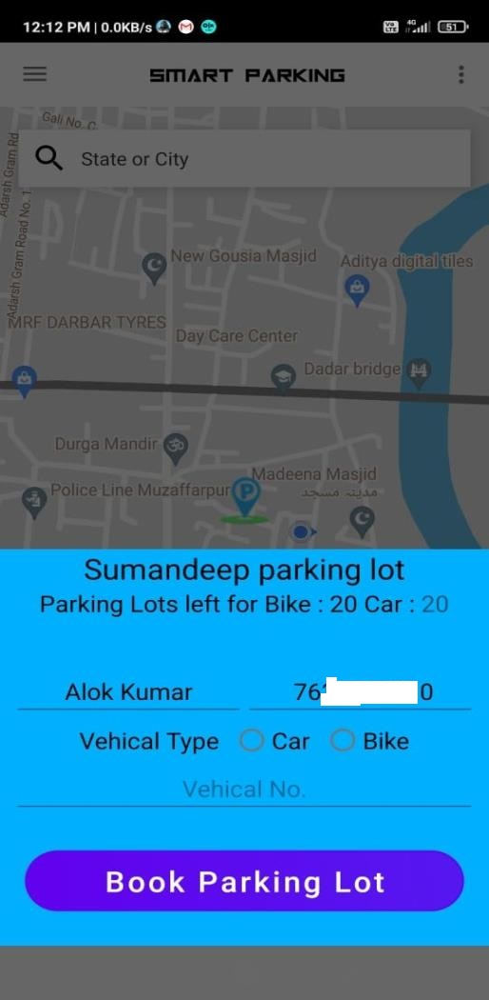
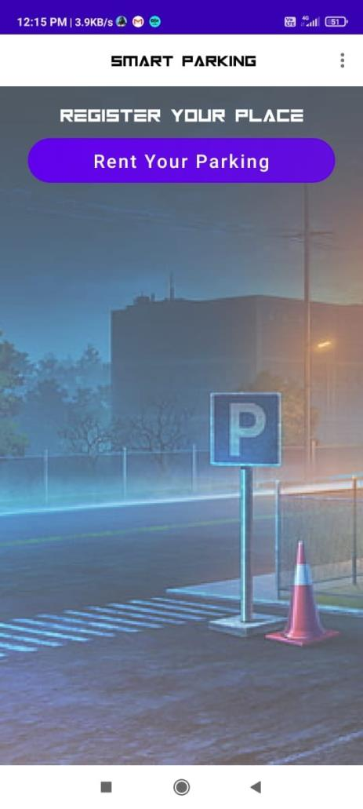
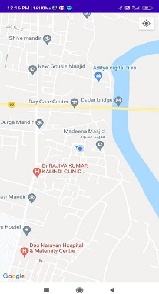
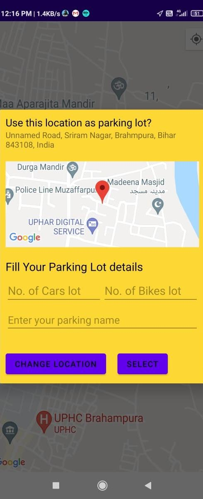
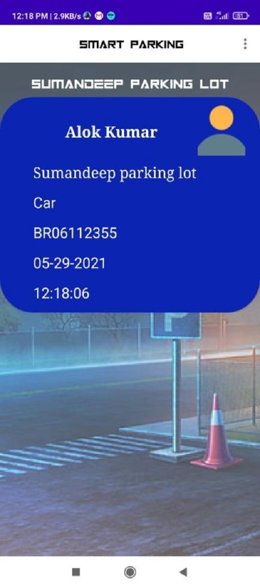

# Contribution
    # @Anjali181
